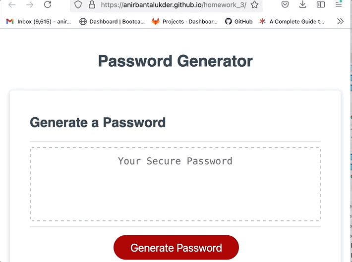

# Homework 3

This is the 3rd homework for the coding bootcamp, where I was asked to write codes to generate random password based on users input.

## Running the code

The codes are linked with the index.html which will render the js and generate the password

## Demo

## Links to deployed page
* [Deployed page](https://anirbantalukder.github.io/homework_3/)
* [Github repo](https://github.com/AnirbanTalukder/homework_3)